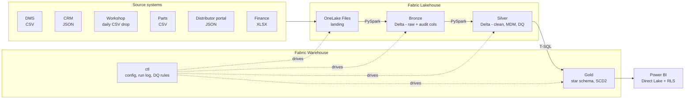
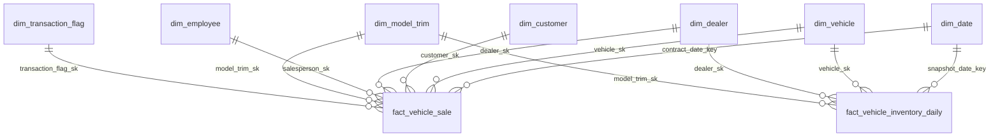
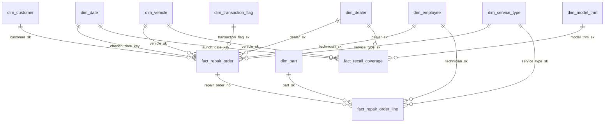
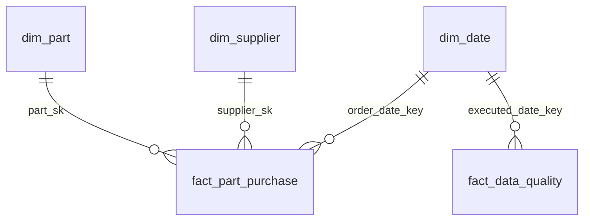

# Mihenk Data Platform

An end-to-end medallion-architecture data platform for a Turkish automotive
distributor, built on Microsoft Fabric.

---

## The business

A distributor that sells vehicles through a franchised dealer network, runs
authorised service workshops, and procures spare parts from suppliers. Three
lines of business, three pillars of the platform:

| Line of business | What it covers |
|---|---|
| **Sales** | New and used vehicle sales, trade-ins, dealer performance |
| **Aftersales** | Scheduled maintenance, repairs, warranty work, body & paint, recall campaigns |
| **Procurement** | Spare part ordering, supplier performance, stock |

Automotive was chosen because it contains genuinely hard modelling problems: a
vehicle (VIN) is both an entity and an object that changes hands over time, a
repair order is a long multi-stage lifecycle, and a warranty claim depends on a
second approval process outside the selling system.

---

## Architecture



| Layer | Technology | Contract |
|---|---|---|
| Generation | Local Python — `pandas` + `Faker` | Seeded, reproducible, ~3 years of history |
| Landing | Lakehouse OneLake `Files/` | Files exactly as a source system would emit them |
| Orchestration | Data Factory pipelines | `pl_daily_load` runs Bronze → Silver → Gold under one batch id; Bronze is metadata-driven — a new source is a row in `ctl.source_config`, not new code |
| Bronze | PySpark notebook → Delta | Raw, append-only, no transformation, mandatory audit columns |
| Silver | PySpark notebook → Delta | Typed, conformed, deduplicated, TRY-normalised, PII-masked, DQ-checked, idempotent upsert |
| Gold | T-SQL → Warehouse | Star schema, surrogate keys, SCD Type 2, aggregates |
| Presentation | Power BI Direct Lake | Semantic model with dealer-level RLS |

Why the engines are split this way: [ADR-0002](docs/adr/0002-hybrid-spark-and-tsql-architecture.md).

---

## Gold layer schema

Three star schemas, one per line of business, sharing `gold.dim_date` and the
conformed dimensions (`dim_vehicle`, `dim_dealer`, `dim_employee`) across all of
them — an employee is the same row whether they sold a car or fixed one, and a
vehicle is the same row on the sales contract and on the repair order.

**Sales & inventory**



**Aftersales (workshop)**



**Procurement & data quality**



Every dimension carries `is_inferred` and SCD Type 2 columns
(`valid_from`/`valid_to`/`is_current` — why: [ADR-0003](docs/adr/0003-vehicle-ownership-modelling.md)).
Full column list: [sql/03_gold/](sql/03_gold/).

---

## What makes this more than a pipeline

- **Metadata-driven ingestion.** `ctl.source_config` defines every source, its
  file pattern, target table, load type and watermark column. The pipeline reads
  the table and loops. Adding a source means inserting a row.
- **Declarative data quality.** `ctl.dq_rule` holds the rules; a procedure runs
  them, writes results to `ctl.dq_result`, and quarantines critical violations.
  Including automotive-specific rules — **VIN check digit validation per ISO
  3779**, odometer monotonicity, repair-order stage sequencing.
- **MDM golden record.** The same customer is written differently in DMS and in
  CRM. Silver normalises, scores similarity, applies survivorship rules and
  issues a `master_customer_id`.
- **Audit and reconciliation.** Every batch is logged with rows read, written and
  rejected. Re-running a batch must not corrupt data.
- **Deliberately dirty source data.** Invalid VINs, reversing odometers,
  out-of-order repair-order dates, orphan keys and duplicate customer spellings
  are injected at a configurable rate — so the DQ layer has something real to
  catch. Crucially, the generator's output is *provably clean* before injection,
  so every defect the platform finds is one that was put there on purpose and can
  be scored against the answer key.

---

## Repository layout

```
mihenk/
├── src/data_generator/     Phase 1 - local Python source-data generator
├── tools/                  Generators: ctl seed data, notebooks, documentation
├── sql/
│   ├── 00_control/         ctl schema: source config, run log, DQ framework
│   ├── 01_bronze/
│   ├── 02_silver/
│   └── 03_gold/            Star schema DDL, SCD2 and fact load procedures
├── fabric/
│   ├── notebooks/          PySpark: Bronze and Silver
│   ├── pipelines/          Data Factory JSON: pl_daily_load → pl_bronze_ingest, pl_silver_transform, pl_gold_load
│   └── setup_steps.md      What to create in Fabric, where, in what order
├── powerbi/
│   ├── semantic_model.md   Tables, relationships, report pages
│   ├── measures_dax.md     Every DAX measure, with the reasoning
│   └── rls_setup.md        Dynamic dealer-level row-level security
├── data/                   Generated output (git-ignored)
└── docs/
    ├── architecture.md
    ├── naming_standard.md
    ├── data_dictionary.md      (generated)
    ├── lineage.md              (generated)
    ├── spark_learning_log.md   Honest record of learning Spark on this project
    └── adr/                    Architecture Decision Records
```

Everything Fabric produces is exported back into this repository — notebooks as
`.ipynb`, pipelines as JSON, DDL as `.sql`. The repository is the deliverable;
the Fabric workspace is only where it is proven to run.

---

## Getting started

**Prerequisites:** Python 3.12+, a Microsoft Fabric workspace on Trial or F-SKU
capacity, Power BI Desktop.

```bash
git clone <repo>
cd mihenk
python -m venv .venv
.venv\Scripts\activate
pip install -r requirements.txt
copy .env.example .env
```

Then edit `.env` — at minimum `MIHENK_OUTPUT_PATH` and `MIHENK_SEED`. Volumes and
dirty-data ratios are not in `.env` on purpose; they define the project and live
in `src/data_generator/config.py` where they are visible in the repository.

Then generate the dataset:

```bash
python -m data_generator --clean
```

About 30 seconds, ~150 MB, 2,326 files across six source systems. Add
`--scale 0.05` to iterate quickly while developing.

The same seed produces **byte-identical** output, and that is checked rather
than claimed:

```bash
python tools/verify_determinism.py
```

It runs the generator twice into two directories and compares every byte.

The run also writes three files that are **not** source data:

| File | Purpose |
|---|---|
| `_manifest.json` | Every entity's format, encoding, load type, watermark and business keys — the seed rows for `ctl.source_config` in Phase 2 |
| `_injection_log.csv` | One row per deliberately injected defect, with the rule code that should catch it. The answer key Phase 3 scores its DQ rules against |
| `_mdm_truth.csv` | Which DMS customer is which CRM customer, and how hard the pair is to match. The answer key for MDM precision and recall |

The two answer keys must never be ingested. They sit outside every source glob
so that cannot happen by accident.

### Regenerating the derived artefacts

Four things in this repository are generated rather than written, so that they
cannot drift from the code they describe:

```bash
python tools/generate_ctl_seed.py    # ctl.source_config, ctl.dq_rule, gold.ref_province
python tools/build_notebooks.py      # .ipynb from the readable .py sources
python tools/generate_docs.py        # data dictionary and lineage
```

| Generated | From |
|---|---|
| `sql/00_control/60_seed_source_config.sql` | `data/_manifest.json` |
| `sql/00_control/70_seed_dq_rules.sql` | rule codes imported from `data_generator.dirty` |
| `sql/03_gold/05_ref_province.sql` | `data_generator.reference` |
| `docs/data_dictionary.md`, `docs/lineage.md` | the DDL, notebooks and load procedures |

Fabric setup is documented step by step in `fabric/setup_steps.md`.

### Local verification dashboard

`web/index.html` is a static, self-contained dashboard built straight from a
generator run — no Fabric, no Power BI, just proof that the six source systems
produce sane, correlated numbers (sales trend, dealer ranking, service mix,
MDM match difficulty, injected DQ defects). Serve it locally:

```bash
python -m http.server 8000 --directory web
```

then open `http://localhost:8000`.

---

## Progress

| Phase | Scope | Status |
|---|---|---|
| 0 | Repository skeleton, naming standard, ADR framework, environment | ✅ Done |
| 1 | Source data generator — 6 systems, 3 formats, seeded, dirty-data injection | ✅ Done |
| 2 | Bronze — `ctl` tables, metadata-driven Data Factory pipeline, PySpark ingest | ✅ Done |
| 3 | Silver — cleansing, DQ framework, MDM golden record, Delta MERGE | ✅ Done |
| 4 | Gold — star schema, surrogate keys, SCD Type 2, facts, aggregates | ✅ Done |
| 5 | Power BI semantic model, DAX, RLS, generated documentation | ✅ Done |

**Phases 0–5 have run end to end on a real Fabric capacity** (Azure
pay-as-you-go F2): the Bronze pipeline ingesting all 17 sources, all
four Silver notebooks, the full Gold layer via `gold.usp_initial_load`, and a
Power BI report on a Direct Lake semantic model. Every verification item in
[ADR-0002](docs/adr/0002-hybrid-spark-and-tsql-architecture.md) has a real
result and a date.

In that first run Silver was started notebook by notebook and Gold from an
`EXEC` in SSMS. The orchestration that removes those manual steps —
`pl_silver_transform`, `pl_gold_load` and the scheduled `pl_daily_load` that
chains all three layers under one batch id — is defined in
[`fabric/pipelines/`](fabric/pipelines/) and documented in
[`fabric/setup_steps.md`](fabric/setup_steps.md) §5b, but has not yet been
executed on the capacity. It is listed here as such rather than assumed.

---

## Key decisions

| # | Decision | Status |
|---|---|---|
| [0001](docs/adr/0001-naming-and-language-standard.md) | English identifiers, Turkish data content | Accepted |
| [0002](docs/adr/0002-hybrid-spark-and-tsql-architecture.md) | Silver in PySpark, Gold in T-SQL | Accepted |
| [0003](docs/adr/0003-vehicle-ownership-modelling.md) | Vehicle ownership as SCD Type 2, not a bridge table | Accepted |

Every non-obvious choice in this project has a record in `docs/adr/` stating what
was considered, what was chosen, and what it costs.
