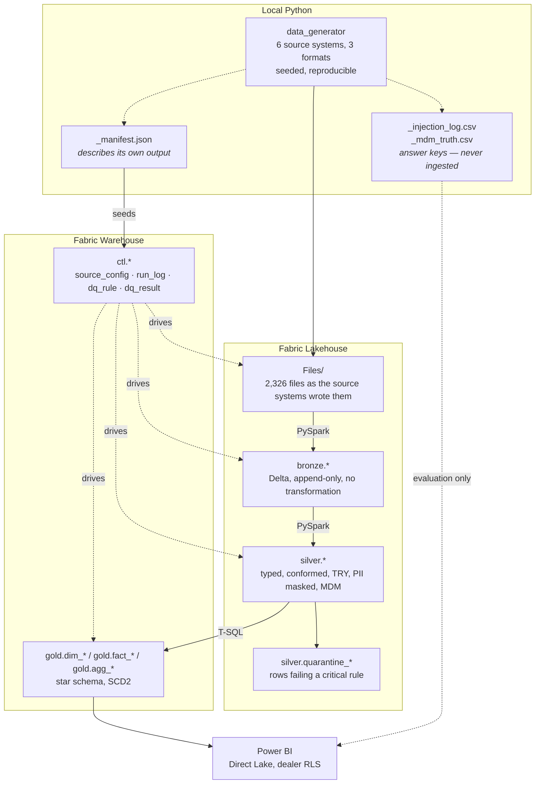

# Architecture

The layer contracts, the boundaries between them, and what each layer is
forbidden from doing. The *why* for the engine split is in
[ADR-0002](adr/0002-hybrid-spark-and-tsql-architecture.md); this describes what
was built.

---

## The shape

---

## Layer contracts

### Landing — `Files/`

Files exactly as a source system would emit them. Six systems, three formats,
one of them not UTF-8. Nothing reads them except Bronze.

### Bronze — Lakehouse Delta

**Does:** read the file, attach five audit columns, write Delta, append-only.

**Does not:** cast a type, trim a string, deduplicate, validate, or fix
anything. `odometer_km` arrives as a string and stays a string.

That restraint is the whole reason the layer exists. The moment Bronze fixes
something, the raw record is gone and there is nowhere to go back to when
Silver's logic turns out to be wrong. Bronze's job is to make the source file
replayable.

The deliberately broken rows — 16-character VINs, `15.03.2024` in an ISO date
column, negative labour hours — land here intact. They are supposed to.

| Audit column | Answers |
|---|---|
| `_ingest_ts` | when did this land |
| `_source_system` | which system produced it |
| `_source_file` | which file exactly |
| `_batch_id` | which run wrote it, and therefore which run can delete it |
| `_row_hash` | has the content changed since last time |

**Idempotency:** the batch deletes its own rows before appending. Running batch
`B20260910` twice leaves the same table as running it once.

### Silver — Lakehouse Delta

**Does:** cast explicitly, conform, deduplicate to the latest per key, convert
every amount to TRY, mask personal data, resolve customers to MDM golden
records, compute derived measures, quarantine rows failing a critical rule.

**Does not:** build slowly changing dimensions. Silver holds the *current*
state; version history lives in Gold. That split is what lets Silver be rebuilt
from Bronze at any time without losing anything.

The consequence surfaces exactly once, in Phase 4: a first Gold load would find
one version per entity. Hence the backfill procedures, which reconstruct history
from Bronze's monthly snapshots. See
[`30_scd2_pattern.sql`](../sql/03_gold/30_scd2_pattern.sql).

**Guarantee after Silver:** every column ending `_amount` is Turkish Lira. That
is what lets the naming standard promise it.

### Gold — Warehouse star schema

Ten dimensions, seven facts, three aggregates. Six Type 2 dimensions, three
Type 1, one junk.

Facts are deliberately not all the same shape — the fact type is a modelling
decision:

| Fact | Type | Because |
|---|---|---|
| `fact_vehicle_sale` | transaction | one contract, one event |
| `fact_repair_order` | **accumulating snapshot** | a process with stages, revisited as it progresses |
| `fact_vehicle_inventory_daily` | **periodic snapshot** | the only way to count a car for *not* selling |
| `fact_recall_coverage` | **factless** | records a relationship; answers a question about absence |

### Presentation — Power BI Direct Lake

Direct Lake over the Warehouse, dealer-level RLS driven by a mapping table.
Nothing is computed in the model that could be computed in Gold, because a
calculated column silently disables Direct Lake for the whole model.

---

## The control plane

`ctl` is not a layer, it is the thing that drives all of them.

| Table | Drives |
|---|---|
| `source_config` | which files exist, how to parse them, full or incremental, watermark |
| `pipeline_run_log` | what ran, rows read / written / rejected, reconciliation |
| `dq_rule` | what to check, as SQL text |
| `dq_result` / `dq_violation` | what was found, per batch, with the offending keys |

Adding a source system is a row in `source_config`. Adding a data quality rule
is a row in `dq_rule`. Neither requires touching pipeline code, which is the
claim the whole design is built to support.

`source_config` is generated from `_manifest.json`, which the data generator
wrote as it produced the files — so the ingestion config cannot disagree with
what the files actually look like.

---

## Boundaries, and the two places they are crossed

Layer boundaries are worth being strict about, so the two exceptions are worth
naming.

**1. The Gold backfill reads Bronze.** `usp_backfill_dim_*` reads the monthly
snapshots directly rather than going through Silver, because Silver holds only
current state. Accepted deliberately, for a one-time load only. The alternative
was a second history in Silver — two structures tracking the same thing — or a
Type 2 dimension with no history, which is not a Type 2 dimension.

**2. The DQ framework has two runners.** `ctl.usp_run_dq_rules` executes the
rules in the Warehouse; `40_silver_dq` executes the same rule rows through
`spark.sql`. The rule definitions are identical and engine-neutral. That
duplication is the payoff of holding rules as data, and it exists because
whether the Warehouse can read Silver at all is ADR-0002 item 4 — still
unverified.

---

## Idempotency, at every layer

The same contract, four times: **a batch owns its rows and can reclaim them.**

| Layer | Mechanism |
|---|---|
| Bronze | `DELETE WHERE _batch_id = ...` then append |
| Silver | `DeltaTable.merge()` with a row-hash comparison — an unchanged row is not rewritten |
| Gold facts | `DELETE WHERE _batch_id = ...` then insert |
| Gold dimensions | change detection by row hash — no change, no new version |
| Watermarks | advanced only after the load has succeeded *and* been logged |

That last row is the one that makes a failure safe. A crash leaves the old
watermark, the next run re-reads the same window, and Bronze reclaims its own
batch — so re-reading is harmless. Skipping would lose rows permanently.

**Between duplicated work and lost data, always choose duplicated work.**

---
